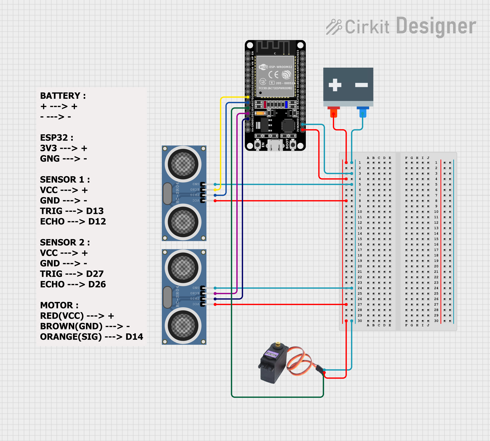
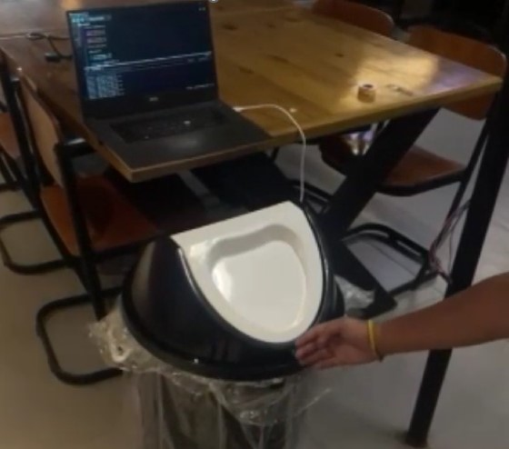
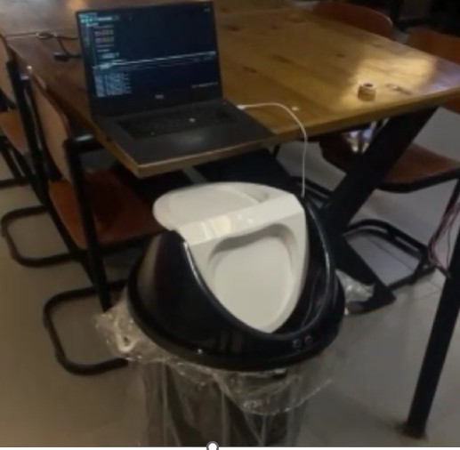
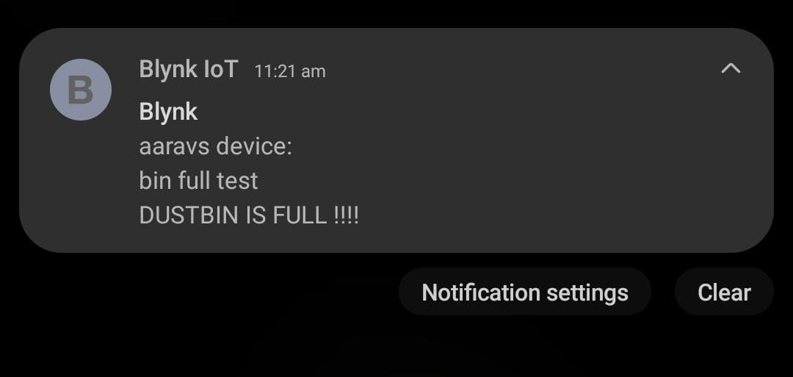

# **Smart Garbage Management**

An IoT-based smart dustbin that enables automatic lid opening and sends real-time notifications when the bin is full. Designed to promote hygiene, reduce manual effort, and improve waste management efficiency.

## **the problem**

- Managing garbage manually across a large campus often leads to overflowing bins and inefficient waste collection.
- Manual monitoring of bins is labor-intensive and time-consuming, leading to delayed waste disposal.
- Traditional bins require physical contact, increasing the risk of contamination and spreading germs.

## **the solution**

- The proposed system uses **ultrasonic sensors** to enable **automatic lid opening** for hands-free operation, ensuring improved hygiene. 
- It also includes a **real-time notification system** to alert the concerned authorities when the bin is full.
This eliminates manual checks, promotes timely garbage collection, and ensures a cleaner and healthier campus environment.

## **the working**

- **Sensor 1 (Lid Control):** When an object is detected within 15 cm, the lid opens using a servo motor. It remains open as long as the object is present and closes 5 seconds after no object is detected.
- **Sensor 2 (Trash Level Detection):** If the trash level is within 10 cm of the sensor for 10 seconds, a notification is sent to the user via the Blynk app.

## **the hardware**

- **ESP32** Microcontroller
- 2x Ultrasonic Sensors (**HC-SR04**)
- Servo Motor (**MG996R**)
- Breadboard
- Jumper Wires
- 9V Battery or Power Bank + USB wire
- Steel Wire / Stick (for mounting mechanism)
- Dustbin (Swing type or flip lid)
- Hot Glue Gun (for mounting)

## **the software**

- **Arduino IDE** (code writing + uploading)
- **Blynk App** (for notifications)
- **Blynk Library** (`BlynkSimpleEsp32.h`)
- **WiFi Library** (`WiFi.h`)
- **Servo Library** (`ESP32Servo.h`)
- **Serial Monitor** (for testing and debugging sensor values)

## **the blynk setup**

- create a new template in blynk.
- add your `BLYNK_TEMPLATE_ID`, `BLYNK_DEVICE_NAME`, and `BLYNK_AUTH_TOKEN` in your code.
- create a new device from the template.
- add *Event* : \
   -Name: `bin_full` \
   -Type: Notification \
   -Message: "Dustbin is full!" 

## **the complete setup**

- **Collect components** (ESP32, sensors, servo, wires, etc.)
- **Connect circuit** as per instructions above.
- **Install Arduino IDE**
- **Install libraries**:
   - ESP32 Board Support
   - Blynk Library
   - ServoESP32
- **upload code**
- **Install Blynk app** and configure template + device + event.
- **Power via power bank**
- **Mount components** inside the bin with hot glue or screws.

## **the circuit**
*ESP32 :*
  - 3V3  → + (Power rail)
  - GND  → - (Ground rail)

*Sensor 1 (Lid Control):*
  - VCC  → + (Power rail)
  - GND  → - (Ground rail)
  - TRIG → D13
  - ECHO → D12

*Sensor 2 (Bin Level):*
  - VCC  → + (Power rail)
  - GND  → - (Ground rail)
  - TRIG → D27
  - ECHO → D26

*Servo Motor (MG996R):*
  - Red    → + (VCC rail or 5V source)
  - Brown  → - (Ground rail)
  - Orange → D14

## **the future**

-add automated garbage bag changer \
-add heated bag sealing mechanism \
-solar-powered smart bin \
-display for fill level and bin status \

## **the screenshots**

[readings video](assets/readings.mp4)

[motor working video](assets/motor.mp4)

[lid opening working video](assets/working.mp4)

